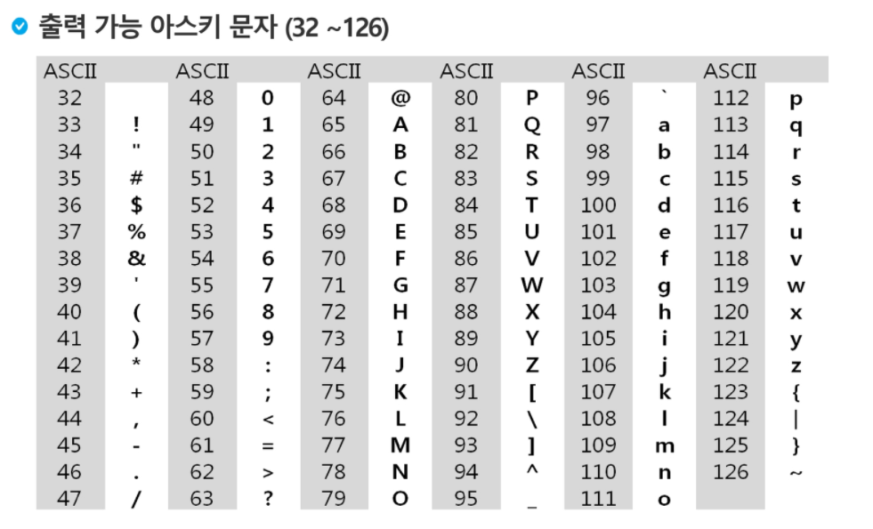
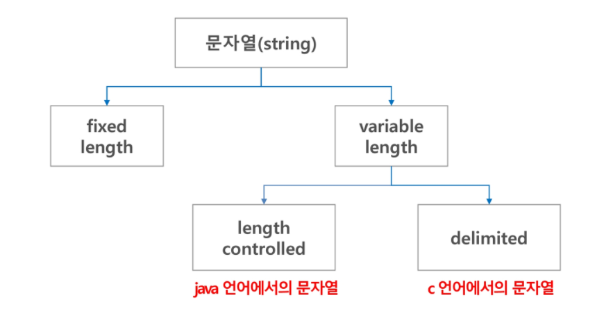

# 문자열(string)

> - 문자열
> - 패턴 매칭
> - 문자열 암호화
> - 문자열 압축


## 컴퓨터에서의 문자표현

> 글자 A를 메모리에 저장하는 방법 : 메모리는 숫자만을 저장할 수 있기 때문에 각 문자에 대해 대응되는 숫자를 정해놓고 이것을 메모리에 저장한다
>
> - 000000 = 'a'
> - 000001 = 'b'
>
> 네트워크가 발전되기 전에는 각 지역별로 코드체계를 정해놓고 사용했지만 인터넷 상용화 후에 혼돈을 피하기 위해 표준안을 만들었다 
>
> 1967년, 미국에서 `ASCII(American Standard Code Information Interchange)`라는 문자 인코딩 표준이 제작됨
>
> - ASCII는 7bit 인코딩으로 128문자를 표현



> `확장 아스키`는 특수문자, 기호 등도 표현 

**한글 코드체계** : 완성형 - `가`, `나`,`다` 완성된 형태의 글자로 표현, 조합형 - `ㄱ`, `ㅏ` 등 조합하는 형식

**다국어 처리를 위한 표준** : 유니 코드 - 다시 Characher Set2 와 4로 분류되고 각 경우를 구분해서 다르게 구현해야 하는 문제 발생, 적당한 외부 인코딩이 필요하게 됨 

- 인코딩 : `UTF-8`, `UTF-16`, `UTF-32` (파이썬 3.x버전에 유니코드 UTF-8이 기본적으로 탑재됨)


## 문자열

### 문자열의 분류




### Python에서의 문자열 처리

- `char 타입`없음 (한 글자도 string으로 인식됨)
- 텍스트 데이터의 취급방법이 통일되어 있음
- 문자열 기호 
  - `''`홑따옴표, `""`쌍따옴표, `+`

```python
str1 = '안녕'
str2 = '하세요'
N = 1

print(str1 + str2) #'안녕하세요'
print(str1 + str2 + N) # 에러발생 
print(str1 + str2 + str(N)) #'안녕하세요 1'

str3 = '-'*20
print(str3) #--------------------
```

- 문자열은 시퀀스 자료형으로 분류되고 인덱싱, 슬라이싱 연산들을 사용할 수 있음
- 문자열에서 제공되는 메소드 : `replace()`, `split()`, `isalpha()`, `find()`...
- 문자열은 튜플과 같이 요소값을 변경할 수 없음(immutable)
- 인덱스 접근 가능 

```python
str1 = '123'
print(str1[1]) #2
str1[1] = '4' #에러 발생

#바꾸기
line = '안녕하세요'
print(line.replace('세', '시')) #안녕하시요 
print(line) #안녕하세요 
line = line.replace('세', '시')
print(line) #안녕하시요 

#쪼개기
print(line.split('하')) #['안녕', '시요']

#숫자와 문자 구분 
password = ''

flag_alpha = False
flag_number = False

for i in password:
    if i.isalpha():
        flag_alpha = True
   	if i.isdigit():
        flag_number = True
        
if not flag_alpha:
    print('비밀번호에 알파벳이 사용되지 않았음')
elif not flag_number:
    print('비밀번호에 숫자가 사용되지 않았음')
else:
    print('완벽한 비밀번호이다')
    
#문자 찾기
line2 = '안녕하시요'
print(line2.find('녕')) #1, 값이 없을 시 -1 반환
print(line2.index('녕')) #1, 값이 없을 시 에러 발생
```


**C와 Java의 String 처리의 기본적인 차이점**

- C : 아스키코드로 저장
- java : 유니코드(UTF16)로 저장


### 문자열 뒤집기

> - 자기 문자열에서 뒤집기 (SWAP) - 문자열 길이의 반만 수행
> - 새로운 빈 문자열을 만들어 뒤에서부터 읽어서 쓰기


```python
def atoi(num_str):
    #최종값을 담을 변수
    value = 0
    
    for i in range(len(num_str)):
        value *= 10 
        #0의 값은 48 
        #value += ord(num_str[i]) - 48
        value += ord(num_str[i]) - ord('0')
        
    return value

num_str = '1234'
num_int = atoi(num_str)

print(num_int, type(num_int))
```


## 패턴 매칭

> - 고지식한 패턴 검색 (Brute Force)
> - 카프-라빈 알고리즘
> - KMP 알고리즘
> - 보이어-무어 알고리즘


### 고지식한 알고리즘 (Brute Force)

> 무차별적으로 가능한 모든 방법을 다 시도하는 것, 가장 순진한 알고리즘 접근법이다
>
> 본문 문자열을 처음부터 끝까지 차례대로 순회하면서 패턴 내의 문자들을 일일이 비교하는 방식 
>
> 시간 복잡도 : 최악의 경우 텍스트의 모든 위치에서 패턴을 비교해야 하므로 O(MN)이 된다. 예시에서는 약 800,000번의 비교가 일어난다.
>
> - 장점 : 직관적이고 명확함 (코드 구현 비교적 용이)
> - 단점 : 인풋이 클수록 오래걸리고 비효율적 -> 효율적인 알고리즘을 찾는 시작점이 된다

```PYTHON
#while문

p = 'is' #찾을 패턴
t = 'This is a book~!' #전체 텍스트
M = len(p)
N = len(t)

def BruteForce(p, t):
    i = 0
    j = 0
    while j < M and i < N:
        if t[i] != p[j]:
            i = i - j
            j = -1
        i = i + 1
        j = j + 1
    if j == M:
        return i - M #검색 성공
   	else:
        return -1
```

```python
#for 문

def BruteForce2(p, t):
    N = len(t)
    M = len(p)
    
    for i in range(N-M+1):
        cnt = 0
        for j in range(M):
            if t[i+j] == p[j]:
                cnt += 1
            else:
                break
                
        if cnt == M:
            return i
    return -1
```


### KMP 알고리즘

> 불일치가 발생한 텍스트 문자열의 앞 부분에 어떤 문자가 있는지를 미리 알고 있으므로 불일치가 발생한 앞 부분에 대해 다시 비교하지 않고 매칭을 수행
>
> 한 방향으로만 이동
>
> (매칭이 실패했을 때 돌아갈 곳을 계산, 모든 경우를 보지 않고 점프함)
>
> 패턴을 전처리하여 배열 next[M]을 구해서 잘못된 시작을 최소화함 
>
> - next[M] : 불일치가 발생했을 경우 이동할 다음 위치
>
> 시간 복잡도 : O(M+N)


### 보이어-무어 알고리즘

> 오른쪽에서 왼쪽으로 비교 
>
> 대부분의 상용 소프트웨어에서 채택하고 있는 알고리즘 
>
> 문자열에 사용되는 문자셋이 클수록 좋다
>
> 패턴 내에 찾고있는 문자가 존재하면 그만큼 맞춰서 점프, 존재하지 않으면 패턴의 길이만큼 점프
>
> - 시간복잡도 : 최악의 경우 O(MN)이 나올 수 있다.
>   - bbbbaaaaaa안에서 baaaa를 찾는 경우 brute force처럼 작동한다

