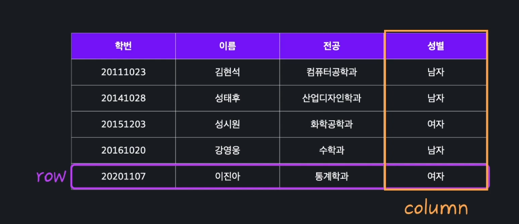

# 개발자를 위한 SQL 데이터베이스 

## SQL로 하는 데이터 분석

### 01. 데이터베이스 기본 개념

1. 데이터베이스와 테이블
   - `데이터베이스` : 일정한 체계 속에 저장된 데이터의 집합, 데이터베이스 내에 여러 개의 테이블이 존재할 수 있음(회원 정보, 상품 정보, 주문 정보...)
   - `테이블` : 데이터가 저장되는 기본 단위, 표 형태로 저장된 데이터의 집합
2. 테이블의 row와 column
   - `row (행)` : 개체 하나를 나타내는 단위
   - `column (열)` : 각 개체가 가지는 속성 하나를 나타냄 

3. DMBS와 SQL
   - `DBMS` : DataBase Management System, 데이터베이스 관리 시스템, 데이터를 저장, 조회 등의 작업을 하게 해준다 
     - MySQL, SQLServer, Oracle, SQLite, MariaDB 등이 있음
   - `SQL` : Structured Query Language, DBMS에 명령을 내리기 위해 사용하는 언어, 국제 표준 SQL이 있어서 여러 DBMS간에 호환성이 있음